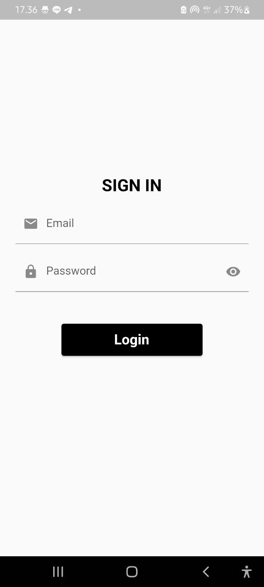
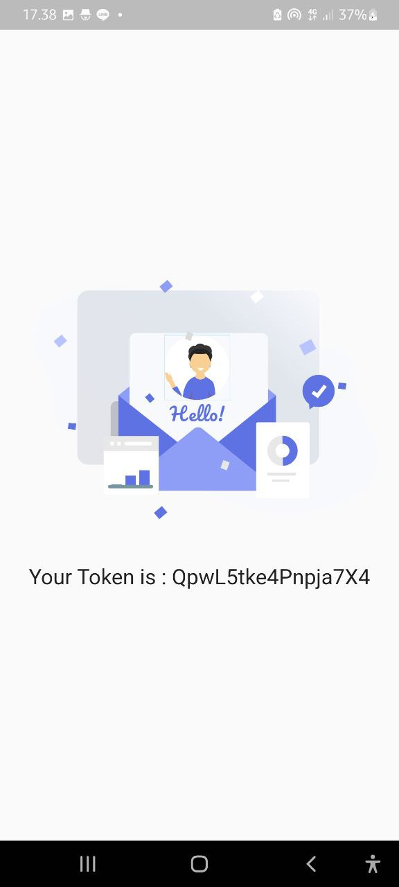
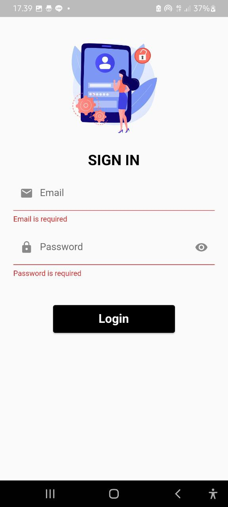

# FLUTTER APP : Simple Login

### Description
Create simple login app using flutter and API from [reqres.in](https://reqres.in/)

### Features
- Login with email and password
- Input validation
- Testing

### Package
- Google_fonts
- Mockito
- Build_runner
- Lottie
- Provider
- Get_it
- Dio

### Tech Used
 

## Screenshots

  |  | |

